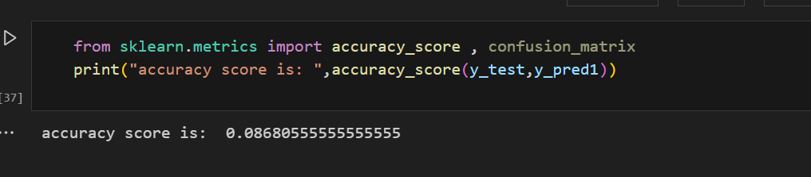

# Toyota Car Price EDA — Data Analysis Project

## Project Overview

This project explores the Toyota car dataset to understand how various features such as horsepower (HP), kilometers driven (KM), engine capacity (CC), and fuel type influence the price of a car.
The analysis is done using Python (Pandas, Matplotlib, Seaborn) for data cleaning, visualization, and insight generation.

## 📊 Dataset Description

The dataset contains details about different Toyota car models with attributes such as:

Model — Name of the car

Price — Selling price (target variable)

Age — Age of the car in years

KM — Kilometers driven

HP — Horsepower

CC — Engine capacity (in cc)

FuelType — Petrol / Diesel / CNG

Doors, Gears, etc.

##  Data Cleaning

Handled missing values in columns like HP, CC, FuelType using median or mode.

Removed duplicates and fixed incorrect entries.

Converted data types (e.g., Price and KM to numeric).

## MACHINE LEARNING MODELS:-
1. Linear Regression-

   It is the basic model used to predict something.

   Here , using this model , price is predicted.

   The mean squared error for the model is 1950000.641649392

   

2. Decision Tree Regressor-

   The mean squared error for this model is 15966125.180555556

   

3. LogisticRegression

   The third model used to predict the price is the LogisticRegression model.

   The accuracy obtained from this model is 0.08680555555555555

   

   

   

## TOOLS AND LIBRARIES USED:

1. Python
2. Pandas
3. Numpy
4. Matplotlib
5. Seaborn
6. Google Colab
7. sklearn.models

## Author

**Publiouse Piouse**  
BSc IT Student | Data Enthusiast | Python Learner  
[GitHub Profile](https://github.com/Publiouse2005)
